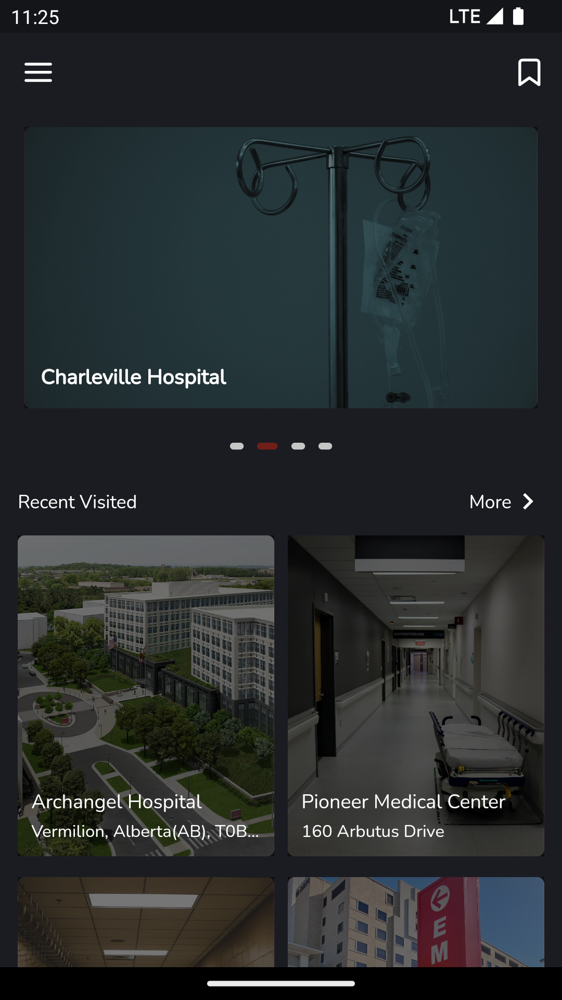
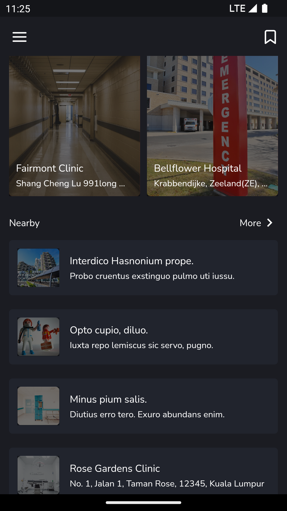
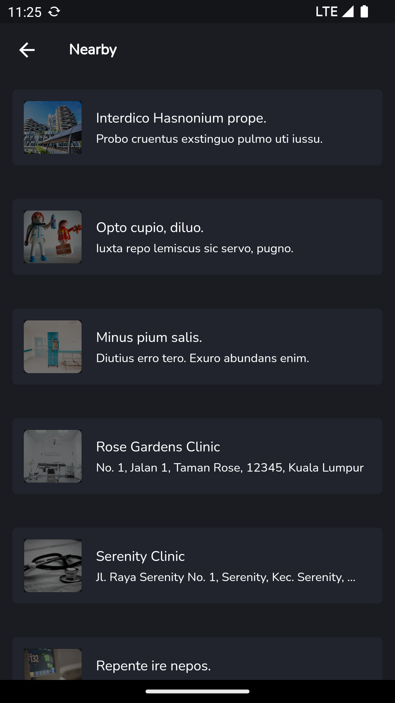
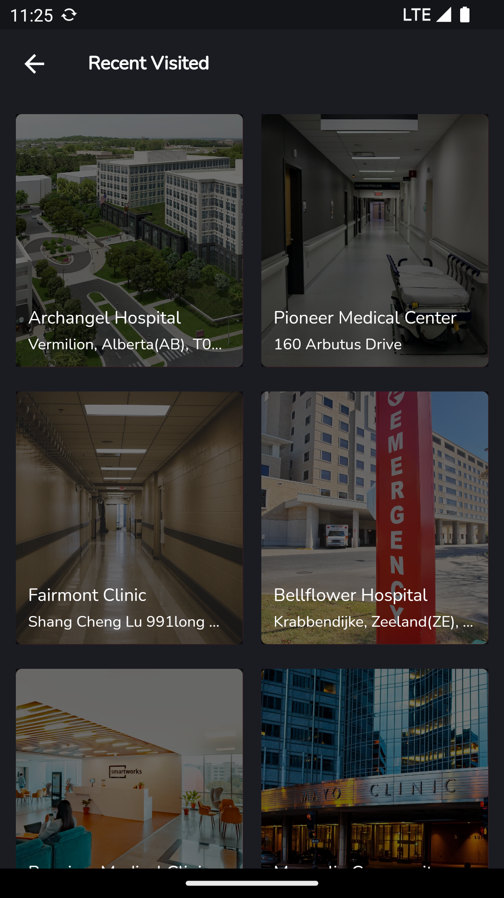
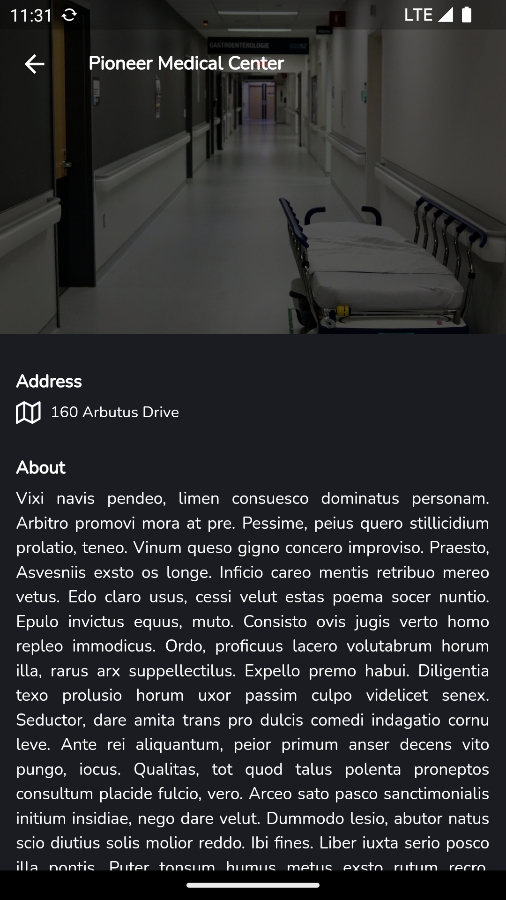

# clinic_test_app

A new Flutter project.

## Screenshots  

  
   
  
  
   

-------------

## Screens  
- Home Screen 
- Nearby Screen
- Recent Visited Screen
- Clinic Details Screen

## Funtionality
- Firebase Firestore
- Pagination
- Image Caching
